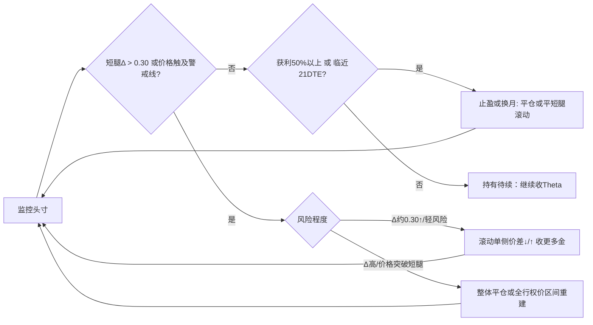

# 执行摘要

本报告基于**上证50ETF期权**，给出空头**铁鹰组合**（Short Iron Condor）的行权价选择与动态管理规则：短腿目标Δ值约0.10–0.16，买入保护腿可选行权价差如0.10元、0.20元、0.30元等（或对应权利金3–5倍规模）。采用30–45DTE合约入场，优选高收益相对安全区间的横盘行情（低波动环境，IV相对较低【49†L1-L4】）。**行权价选择**应考虑Delta（对应成功概率）、价差宽度、隐含波动率偏度和流动性等因素；**滚动调整**以短腿Δ、价格偏离、收益水平、IV变化为触发条件，优先应对触及风险一侧（**整体下移/局部滚动**），再考虑平仓或对冲；**换月时机**常见为剩余DTE约21天或获利达到50–75%时【51†L1-L4】。全报告包含决策表和示例流程图，并给出盈亏示意图及风险说明，可直接作为交易规则参考。

**适用性提示：** 文中建议标注了“适合: …”标签，说明建议在长期滚动（低波动）、短期投机（中度波动）或高波动市况下的适用性。

# 一、行权价选择原则

- **Delta/概率**：空头短腿选在相对平值略虚的位置（目标Δ≈|0.10–0.16|），这对应标的到期跌破（认沽）或涨破（认购）的概率约15–20%（即成功率80–85%）。此区间权利金适中、赚取Theta效果较好（正Theta头寸）。过近ATM（Δ≥0.25）收更多权利金但易被触及，建议**勿卖深度ATM**【56†L94-L100】【61†L63-L66】；过深虚值（Δ<<0.10）权利金太少，难成仓。_适合长期滚动_。

- **价差宽度**：保护腿（Long Wing）与短腿之间的价差影响风险/收益：宽度越小（如0.10元），收的权利金越多，盈利区间越窄，最大风险适中；宽度越大（如0.30元），收金较少，盈利区间广，最大损失大（宽度减权利金）【56†L94-L100】。  
  **示例权衡表**（假设标的≈2.95元）：

  | 价差宽度 (元) | 大致收金/份额 | 盈利区间（BRE） | 最大亏损/份额        | 保证金要求             | 特点（适合场景）        |
  |:---------:|:-----------:|:----------------:|:-------------------|:----------------------|:---------------------|
  | **0.10**  | 较高（信用高） | 窄（~短腿±收金）   | 低（≈价差–收金）      | 较低                | 盈利可能快（回撤小），适合*短期投机*/震荡市 |
  | **0.20**  | 中等         | 中等               | 中等                | 中等                | 权衡风险收益，适合*中线震荡*/常规滚动   |
  | **0.30**  | 较低         | 宽（扩大利润区）   | 高（≈价差–收金）      | 较高                | 收金少但保险大，适合*低波动期*想宽幅布局 |

  - *权利金比率*：通常买入腿权利金约为卖出腿的3–5倍，即收净值为行权差宽度的20–30%（如上例0.1宽可能收0.025/份，0.2宽收0.05/份）。  
  - *流动性*：50ETF期权为A股首批ETF期权之一，已较成熟、流动性较好，但深度OTM合约流动仍逊近月。尽量选流动性较好的行权价。_适合长期滚动/对冲型_。  

- **IV偏斜与方向偏好**：在国内，虚值认沽通常IV偏高（市场更担心暴跌），而认购波动相对较低。因此卖出看跌可能收金更多，但也承担更大下行Γ风险；卖认购可视看涨偏好收金。构建策略时，一般**对称选取相同幅度**的认购、认沽短腿；若有方向偏好，可将整体区间上移或下移【47†L49-L57】（例如看涨略上移卖出价更高的认购）。无明显方向时可做平值铁鹰（Call、Put选价类似）。【47†L49-L57】  

- **流动性**：尽量选成交活跃的合约。50ETF期权有做市商支持，近期月份和价近ATM的合约一般最活跃。避免卖出隔壁翼（买入腿）即将行权导致高成本。

# 二、交易时机与环境

- **建仓时机（IV & 趋势）**：  
  - **IV阶段**：宜在*相对低波动期*（IV排行偏低）时建仓。国内经验显示，当**IV Percentile/Rank <50%**时较适合做铁鹰【49†L1-L4】（波动不大，卖方收金较可观；IV高时市场偏不稳）。若IV正处于高位待回落，则可尝试（回落有利Theta），但需留意波动风控。_适合低波动/震荡市_。  
  - **趋势过滤**：避免在明显单边趋势中建仓。可用ADX等指标：**ADX <20–25**通常表示无明显趋势，适合布局铁鹰；若ADX突破高位、价格接近均线交叉，则表明趋势增强，应回避【50†L5-L8】。同样避开重要事件窗口（经济数据、政策会议、企业财报等）附近，因为大幅波动风险高。_适合长期滚动_。  

- **例子说明**：若50ETF当前2.90元，IV%tile为20%（处于低位），ADX=15（弱趋势），市场未见大消息，则可视为建仓良机；若相反IV飙高或趋势显著，则推迟或防守。

# 三、移仓触发规则与操作

- **触发条件**：  
  1. **短腿Δ阈值**：当任一短腿Δ超过约0.25–0.30（价外概率降至70%左右）时视为风险开始增大，需要处理。若Δ>0.35（<65%成功率）风险更高，应迫切调整。  
  2. **价格接近/突破**：标的价格接近短腿行权价或已经进入原有翼内（如跌穿认沽短腿或涨破认购短腿），意味着接近盈亏平衡点，触发调整。可参考盈亏点公式【61†L63-L66】【47†L37-L44】。  
  3. **未实现损益**：浮盈达到预期止盈（如净权利金50–75%【51†L1-L4】）时可分批止盈或离场；浮亏达到一定比例（如回吐原权利金的50%-100%）时考虑止损。  
  4. **IV变化**：若短期IV剧增，策略净多Vega风险大，宜考虑减少敞口或对冲（如买入少量保护性期权或对标的反向对冲）。  

- **优先级与具体操作**：通常按**风险度递增**优先：  
  - **轻度风险**（Δ≲0.30，价格未过短腿，仅接近）：可**单边滚动**（Spread Roll）。例如标的略跌，买入的Put保护不变，**将卖出Put/买入Put的价差整体下移**（或仅卖出腿下移买更深OTM的Put）以收更多权利金并降低Δ【47†L61-L63】。同理，上涨则调整Call侧向上。此举可扩大盈利区间并收更多金，但也缩小保护厚度。_适合短期调整_。  
  - **中度风险**（Δ ~0.30–0.35，价格已接近短腿或横盘）：优先**整体下移/上移头寸**（Roll Full）。即平掉当前四腿，重建一个新的铁鹰（同方向向下或向上移一到两个行权价位或换下一合约）。若预计趋势可能持续，此法增加安全边际，扩大后续盈利区间；若行情反转可能放弃机会。_适合长期滚动_。  
  - **严重风险**（Δ＞0.35，价格突破保护腿或接近）：可考虑**部分止损/转为垂直价差**：先买回深度实值的一侧短腿并同时卖出对应买入腿（转换为宽跨式bear/bull spread），从而锁定亏损。或者直接**整体平仓**止损。极端时亦可对冲（买ETF或沽期货）缓和Delta敞口。  

- **调整示意**（流程图）：

- **操作示例表**：

  | 阶段     | 条件                 | 操作                   | 说明（适用性）                |
  |---------|--------------------|------------------------|------------------------------|
  | 建仓     | 50ETF=3.00元，IV%tile=20%，ADX<20 | 卖2.90P/3.00C买2.80P/3.10C | 短腿Δ≈0.15，【61†L63-L66】。收26000元。_适合震荡期_。 |
  | 调整1    | 价格跌至2.95，短PutΔ≈0.28   | 仅下移Put价差: 卖2.85P买2.75P     | 收取额外权利金，降低Delta（Δ降至~0.18）。_适合追加保护_。 |
  | 调整2    | 价格继续跌至2.88，短PutΔ≈0.40 | 平掉旧头寸+重建更低一档: 卖2.80P买2.70P & 卖3.10C买3.20C | 扩大支撑，锁定损失上限。_适合趋势偏跌_。 |
  | 止盈     | 回吐部分后反弹回3.02，净权利金已有≈50% | 平全部仓位             | 获利出局。_适合事件避险_。 |

(以上均为假设示例，仅说明操作思路。)

# 四、换月规则

- **剩余DTE**：通常**剩余DTE≲21天**时即考虑换月【51†L1-L4】。到期前三周后Gamma急剧增加，若未达到目标利润，应尽快平仓或转至下月或季月合约，以避免尾盘风险和流动性降低。_适合长期滚动_。

- **盈利阈值**：当头寸收益达到最大潜在的50–75%【51†L1-L4】，可平仓锁利或换月建新；反之若仍有时间，亦可继续持有直至触及限度或剩余DTE阈值。

- **流动性/价差**：换月时务必选择流动性好的新合约系列。若当前合约Bid-Ask已过宽或挂单难成交，也应换月出清。

- **换月方式**：滚动开仓通常为**先平旧月，再开新月**，保证金一次调整到位。如能同时做双腿换月收平价差，需谨慎计算成交价。  

# 五、风险控制与仓位管理

- **保证金比例**：单笔铁鹰组合通常占用一定保证金（依公式计算，大致≈卖出腿行权价×单位+偏差）。建议单笔保证金不超过资金的**10–20%**；总体期权策略仓位（包括所有信用策略）不超总资金的30%。多头股票/期权对冲前应预留保证金。

- **最大亏损触发**：若某一铁鹰组合累亏达到入场权利金的**100%**或绝对回撤5-10%（根据风险承受定），就要考虑强制平仓，以保护资金。

- **对冲**：对于临近调整点但尚未平仓前，可考虑**Delta对冲**：如标的急跌，可买入适量50ETF或做空ETF期货；急涨则卖出ETF。此法能暂时锁定浮损，给调整争取时间。【52†L1-L4】  
- **分仓控制**：可将资金分为若干相同策略单位，分批建仓、分批调整，避免单一头寸失败导致整体大损。

- **其他对冲策略**：视情况买入单边期权保护（如价格跌势时买深ITM的更长DTE看跌）或卖出额外跨式/蝶式期权对冲尾部风险。_适合高波动期_。

# 六、盈亏示意图

【64†embed_image】 *图：典型空头铁鹰组合（Short Iron Condor）的盈亏示意图。该图示例卖出95号看跌、105号看涨（短腿），买入90号看跌、110号看涨（保护腿）。Profit区间在93.5–106.5之间（即短腿±净权利金）；红色区域为最大亏损限制。※示意：价格单位假设为美元。*

(图示仅示意盈利区间宽窄及风险上限，具体数字参照实际权利金调整。)

# 七、示例流程

**示例1：横盘震荡市**（**适合：长期滚动/收Theta**）  
- **背景**：50ETF现2.90元，无明显新闻。近期IV偏低（IV%tile≈20%），ADX≈15（震荡）。  
- **建仓**：30DTE到期月，卖2.80元Put、买2.70元Put；卖3.00元Call、买3.10元Call。短腿Δ≈0.14（合约代码做市商行情）。收净权利金0.025元（假设总计2500元/万份）。  
- **持有**：标的数日窄幅波动在[2.85–2.95]，Theta正值持续赚权利金。  
- **调整1**：价格涨至2.98元，Call Δ升至≈0.30，接近右侧盈亏点，可**向上滚Call价差**：买回现有卖3.00C/买3.10C价差，同时卖3.10C买3.20C（相当于上涨一档）。收回些许权利金，降低Call侧Δ。  
- **止盈/换月**：后期若价格再回到2.90元，保护腿均安全，可分两批平仓（先收回剩余短腿利益，再平掉长腿）。或当剩余DTE≈21天时，将头寸换至下月同结构（收开仓新权利金）。

**示例2：温和下跌趋势**（**适合：趋势追踪/短期调整**）  
- **背景**：50ETF现3.00元，市场风险事件后下探，IV上涨。短期均线下穿长线显示小趋势。  
- **建仓**：卖2.90P买2.80P；卖3.10C买3.20C。收金2600元。【61†L63-L66】  
- **调整1**：价格跌至2.92元，短Put Δ≈0.25，已接近盈亏点（下BE≈2.874【61†L63-L66】），主动**下移铁鹰**：平旧Put Spread（2.90/2.80），卖2.80买2.70建新Put Spread。此举扩大下方保护区间，收额外权利金。  
- **调整2**：若续跌至2.85元，Put Δ>0.35，风险急增，此时可**平全头寸止损**，或者若预期反弹，只做Partial Hedge：买入少量2.80Put或50ETF以对冲。  
- **结果**：价格若最终维持2.85–3.05，则新配置后依旧有盈利空间；如触及保护腿则最大亏损固定。

**示例3：快速上涨市**（**适合：逆向对冲/短线退出**）  
- **背景**：50ETF现2.95元，市场突然强势拉升。  
- **操作**：如卖出的3.05C或3.10C被快速挑战，可**上移Call Spread**：买回3.05/3.15 Call Spread，卖3.15/3.25新Spread，锁定部分收益并延展上方BE点。  
- **对冲**：同时或取代滚动，可购入50ETF现货或期货对冲一部分上行Delta。  
- **平仓**：若上行过猛，应及时平仓认沽边并剩余认购边转为牛市差赚取价差收益。  

# 八、风险与不确定性说明

- **假设与缺口**：本研究假设50ETF价格/波动率水平按示例情形（价格区间≈2.8–3.2元，IV中低位），未考虑分红、政策突发等因素。报告中止盈止损阈值、Δ界限等参数，仅供参考；实际可根据账号风险承受能力调整。  
- **数据缺失**：未提供实时波动率、成交价差等行情数据，影响对IV Rank和流动性判断的精度。保证金占比与具体数值需结合券商费率和实际仓位计算，本文只提原则比例。  
- **市场假设**：策略在“震荡不剧烈”假设下盈利；若遇A股特有的大幅跳空、临时停牌等情况，理论盈亏模型会失效。**对策**：设定硬性止损点、随时变更策略。  
- **结论影响**：上述缺口可能使建议在极端行情下效果下降（例如IV快速飙升时，卖出头寸可能迅速亏损；跳空时即使Delta小也可能一夜全亏）。因此，本文建议仅作为策略框架，实际操作需结合实时行情动态调整。  

**结论**：空头铁鹰适合预期区间震荡的上证50ETF市场，构建要点为“适度虚值卖出+分层买入保险”，动态管理要紧跟标的价格与波动变化，及时滚动或止损。文中决策表与示例流程提供了具体操作思路，可根据风险偏好进行微调。【61†L63-L66】【47†L61-L63】【49†L1-L4】【56†L94-L100】

